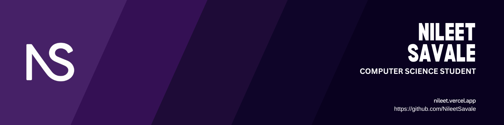

<!-- 🔥 Header Image -->

  

<!-- 🔗 Socials -->

  
  
  
  

<!-- 👁 Profile Views -->

  

---

## 🍽️ Nileet's Dev Café
### 
<i>One shot of code, two shots of coffee.</i>

---

## ☕ Starter

|                     |                                                  |
|---------------------|--------------------------------------------------|
| 🧑‍💻 Name             | **Nileet Savale**                                 |
| 🏫 University        | Indiana University Bloomington, USA 🇺🇸           |
| 🛠️ Current Focus     | Cloud Server & LangViz 🌐                        |
| 🌱 Learning Stack    | React, Docker, R, TypeScript                     |

---

## 🍝 Main Course

### 🧑‍🍳 Featured Projects

- **LangViz App**: Language-Agnostic Visualizer  
- **Monster File Editor**: Dungeon Editor for Angband RPG  
- **Meeting Companion**: Chrome Extension + AI Summarizer  
- **Flashcard Genie**: AI-based Flashcard Generator

### 🧰 Tools & Stack

---

## 🍰 Dessert

> ☕ *Fun Fact:* Give me a coffee and I’ll debug your universe  
> 🎮 Gamer at heart | 🎨 UI Obsessed | 🧩 Always cooking something new in my mental kitchen

---

<!-- 📈 GitHub Stats (optional: uncomment later)
## 📊 GitHub Stats

  
  

-->

<!-- 🧰 Optional Tech Stack (commented for future)
## 🛠️ Tech Stack

- 🐍 Python | ⚡ FastAPI | 🧠 AI & Data
- 🌐 React | 💅 Tailwind | 🐳 Docker | 🔧 Git
-->

---

## 📌 Pinned Repositories

  
  

---

  <strong>Thanks for visiting <i>Nileet’s Dev Café</i> — come back hungry for code! 🍜</strong>

