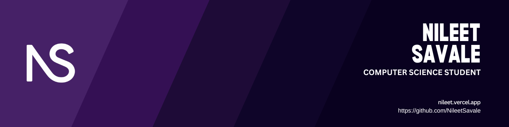

<!-- 🔥 Header Image -->

  

<!-- 🔗 Socials -->

  
  
  
  
  

<!-- 👁 Profile Views -->

  

---

## 
<i>🍽️ Nileet's Dev Café</i>

### 
<i>One shot of code, two shots of coffee.</i>

---

## ☕ Starter

|                     |                                                  |
|---------------------|--------------------------------------------------|
| 🧑‍💻 Name             | **Nileet Savale**                                 |
| 🏫 University        | Indiana University Bloomington, USA           |
| 🛠️ Current Focus     | Cloud & Network Security 🌐                        |
| 🌱 Learning Stack    | AWS, Docker, Flutter, GCP                    |

---

## 🍝 Appetizers

### 🧑‍🍳 Featured Projects

- **LangViz App**: Language-Agnostic Visualizer  
- **Monster File Editor**: Dungeon Editor for Angband RPG  
- **Meeting Companion**: Chrome Extension + AI Summarizer  
- **Flashcard Genie**: AI-based Flashcard Generator

## 🍽️ Main Course – Tools & Tech Stack

### 🗣️ Languages

| Language     | Price (Proficiency) |
|--------------|---------------------|
| 🐍 Python     | $8.49               |
| ☕ Java       | $7.49               |
| 💻 C++        | $7.49               |
| 🧠 TypeScript | $7.99               |
| 🌐 JavaScript| $8.25               |
| 🧬 Solidity   | $3.99               |

---

### ⚙️ Frameworks & Libraries

| Framework / Library   | Price (Proficiency) |
|------------------------|---------------------|
| ⚛️ React               | $8.99               |
| 🔗 Node.js             | $8.25               |
| 🧪 TensorFlow          | $7.50               |
| 🔥 PyTorch             | $6.99               |
| 👁️ OpenCV              | $6.75               |
| 🐼 Pandas              | $7.25               |
| 🔬 Scikit-learn        | $6.25               |
| 📊 NumPy               | $7.00               |
| 🧠 NLTK                | $6.49               |

---

### 🛢️ Databases

| Database  | Price (Proficiency) |
|-----------|---------------------|
| 🍃 MongoDB | $6.49               |
| 🐬 MySQL   | $6.49               |
| 📊 SQL     | $6.49               |

---

### 🧰 Tools & Platforms

| Tool / Platform    | Price (Proficiency) |
|---------------------|---------------------|
| 🧷 Git               | $9.00               |
| 🐙 GitHub            | $9.00               |
| 📓 Jupyter Notebook  | $8.50               |
| ✏️ Figma             | $8.50               |
| 🪄 Adobe XD          | $8.00               |
| ☁️ AWS               | $8.50               |
| ☁️ GCP               | $8.00               |
| 🐳 Docker            | $7.49               |

---

> 📦 **Note**: Prices are subjective. Tips accepted in the form of coffee ☕ or cool bugs 🐛.

---

## 🍰 Dessert

> ☕ *Fun Fact:* Give me a coffee and I’ll debug your universe  
> 🎮 Gamer at heart | 🎨 UI Obsessed | 🧩 Always cooking something new in my mental kitchen

---

📈 GitHub Stats (optional: uncomment later)
## 📊 GitHub Stats

  
  

<!-- 🧰 Optional Tech Stack (commented for future)
## 🛠️ Tech Stack

- 🐍 Python | ⚡ FastAPI | 🧠 AI & Data
- 🌐 React | 💅 Tailwind | 🐳 Docker | 🔧 Git

---

## 📌 Pinned Repositories
<!-- 

  
  

 -->

---

  <strong>Thanks for visiting <i>Nileet’s Dev Café</i> — come back hungry for code! 🍜</strong>

